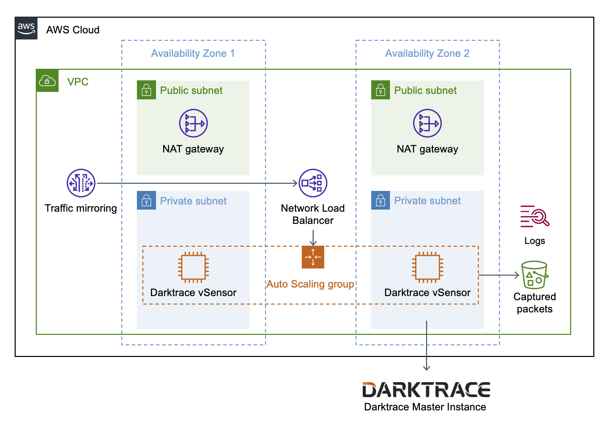

# Darktrace vSensor Quickstart for AWS

## Overview

This Quick Start deploys Darktrace vSensor virtual threat detection on the Amazon Web Services (AWS) Cloud. Instead of relying on flow logs, Darktrace probes analyze raw data from mirrored virtual private cloud (VPC) traffic to learn to identify threats. This guide covers the steps necessary to deploy this Quick Start.

Amazon Virtual Private Cloud (VPC) traffic mirroring copies traffic from Amazon Elastic Compute Cloud (Amazon EC2) instances you want to monitor. A Network Load Balancer distributes mirrored traffic to Darktrace vSensor probes in private subnets. The deployment also supports sending data to vSensors from Darktrace osSensors you configure on virtual machines, containerized applications, and legacy EC2 instance types that do not support traffic mirroring.

Darktrace vSensor extracts relevant metadata from mirrored traffic. Your existing Darktrace / NETWORK deployment analyzes the metadata in real time to identify threats. PCAP data can be stored in an Amazon Simple Storage Service (Amazon S3) bucket for later forensic retrieval.

Darktrace vSensors support syslog to [integrate](https://darktrace.com/integrations) with third-party security information and event management tools.

### High Availability on AWS
If you choose to deploy more than one vSensor, they are deployed across multiple Availability Zones for high-availability. For more information, see [Regions and Availability Zones](https://aws.amazon.com/about-aws/global-infrastructure/regions_az/).

This guide is for database administrators, enterprise architects, system administrators, and developers who want to run Darktrace vSensor probes in a highly-available Amazon Elastic Compute Cloud (Amazon EC2) environment.

## Costs and licenses

This Quick Start requires a valid update key obtained from the [Darktrace Customer Portal](https://customerportal.darktrace.com/) or a Darktrace representative. You must provide a valid update key during deployment in order for the Quick Start to launch successfully. A free demo is available. Contact your Darktrace representative or [sign up for a demo today!](https://darktrace.com/demo).

## Architecture
Deploying this Quick Start with default parameters builds the following Darktrace vSensor environment in the AWS Cloud.

_Figure 1. Quick Start architecture for Darktrace vSensor on AWS_

As shown in _Figure 1_, this Quick Start sets up the following:

* A highly available architecture (when 2+ Availability Zones are used).

* A virtual private network (VPC) configured with public and private subnets, according to AWS best practices, to provide you with your own virtual network on AWS.*

* In the public subnets:

    * Managed network address translation (NAT) gateways to allow outbound internet access to Darktrace vSensor instances.*

* In the private subnets:

    * An Auto Scaling group of Darktrace vSensor probes hosted on Amazon EC2 instances.

* VPC traffic mirroring to send mirrored traffic to a Network Load Balancer.

* A Network Load Balancer to distribute monitored VPC traffic to Darktrace vSensor instances.

* An Amazon S3 bucket to store packets captured by Darktrace vSensor.

* Amazon CloudWatch to provide logs to collect metrics from Darktrace vSensor EC2 instances.

_*The template that deploys this Quick Start into an existing VPC skips the components marked by asterisks and prompts you for your existing VPC configuration._

## Deployment options

This Quick Start provides the following deployment options:

* [Deploy Darktrace vSensor into a new VPC](https://console.aws.amazon.com/cloudformation/home#/stacks/create?stackName=Darktrace-Vsensor&templateURL=https://darktrace-vsensor-quickstart-public.s3.us-east-1.amazonaws.com/cfn-ps-darktrace-vsensor/templates/darktrace-vsensor-main.template.yaml). This option builds a new AWS environment that consists of the VPC, subnets, NAT gateways, security groups and other infrastructure components. It then deploys Darktrace vSensor into this new VPC.

* [Deploy Darktrace vSensor into an existing VPC](https://console.aws.amazon.com/cloudformation/home#/stacks/create?stackName=Darktrace-Vsensor&templateURL=https://darktrace-vsensor-quickstart-public.s3.us-east-1.amazonaws.com/cfn-ps-darktrace-vsensor/templates/darktrace-vsensor-workload.template.yaml). This option provisions Darktrace vSensor in your existing AWS infrastructure.

This Quick Start provides separate templates for these options. It also lets you configure Classless Inter-Domain Routing (CIDR) blocks, instance types, and Darktrace vSensor settings.

## Predeployment steps

### Generate AWS Systems Manager parameters
The Quick Start now uses AWS Systems Manager Parameter Store to securely hold the configuration and secrets for Darktrace vSensor.

[Create](https://docs.aws.amazon.com/systems-manager/latest/userguide/sysman-paramstore-su-create.html) separate "Secure String" SSM Parameters in the expected AWS region for each of the following:

vSensor Update Key (e.g. `abcdefg:12345678`)

Darktrace Instance Hostname (e.g. `https://instancename.cloud.darktrace.com:443`)

Darktrace Instance Push Token (e.g. `vsensor-push-token:123456abcdefg`)

Darktrace Instance Proxy (e.g. `http://proxyname.example.com:3128`, `http://username@password:proxyname.example.com:3128` or `none` to not use a proxy)

osSensor HMAC (e.g. `ossensorhmac123456abcdefg` or `none` to disable osSensor support)

You will provide the parameter names to the CloudFormation template, for the vSensor to automatically decrypt these values on start up.

Using SSM parameters allows configurations to be more easily cycled out using the Auto Scaling Group Instance Refresh features, without having to redeploy the Quick Start template.

>Please review [ASG Instance Refresh Documentation.](https://docs.aws.amazon.com/autoscaling/ec2/userguide/asg-instance-refresh.html) Refreshing all instances will cause an outage, since instances are terminated before new instances are created.

### Register a push token
Register a new push token to enable connection between vSensor probes and an existing Darktrace on-premise or cloud instance. All of the vSensor instances in this deployment share the same push token.

1. Log into the Darktrace console.

1. On the main menu, choose **Admin > System Config**.

1. In the **Push Probe Tokens** section, enter a label for the vSensor deployment.

1. Choose **Add**. A token is generated in the form of `[label:string]`.

1. Record the token, as it only displays once. You must enter the token in the **Darktrace Instance push token** parameter field during Quick Start deployment.

If your Darktrace Instance is behind a firewall, you must grant access to the instance from the IP addresses of your NAT Gateways after deployment. For more information, see Post deployment steps, later in this guide.

>Darktrace-hosted cloud instances are already configured to allow push token access, no firewall changes are necessary.

### Traffic Mirror Configuration Modes
It is important you must understand the different traffic mirroring options available before deploying.

The option `CrossZoneLBEnable` has been provided to reduce bandwidth costs for traffic ingestion.

**If "No" is set** (the default), the load balancer will only send mirrored traffic to vSensors in the same Availability Zone as the mirror source. The same is true for osSensor traffic.

This option reduces costs by preventing mirror traffic from crossing zones, which can be substantial in large bandwidth environments.

>**You must configure the number of vSensors deployed (minimum and desired) to meet or exceed the count of availability zones deployed to, otherwise traffic mirror sessions and osSensors in zones without vSensors will not be mirrored.**

**If "Yes" is set**, it is possible to reduce the vSensor count as low as 1 without loss of traffic mirroring, this may be suited to small traffic environments.

**Select at least 2 availability zones for highly available fault tolerance.**

## Deployment steps

1. Sign in to your AWS account, and launch this Quick Start, as described under the **Deployment options** section above. The AWS CloudFormation console opens with a prepopulated template. Deployment takes about 30 minutes to complete.

1. Choose the correct AWS Region, and then choose **Next**.

1. On the **Create stack** page, keep the default setting for the template URL, and then choose **Next**.

1. On the **Specify stack details** page, change the stack name if needed. Review the parameters for the template. Provide values for the parameters that require input. For all other parameters, review the default settings and customize them as necessary. When you finish reviewing and customizing the parameters, choose **Next**.

    >Unless you are customizing the Quick Start template code for your own deployments, do not change the default settings for the following Amazon S3 parameters: **Quick Start S3 bucket name**, **Quick Start S3 bucket Region**, and **Quick Start S3 key prefix**. Changing these settings automatically updates code references to point to a new Quick Start location. The defaults provided link to the latest versions in the official Darktrace repository.

1. On the **Configure stack options** page, you can [specify tags](https://docs.aws.amazon.com/AWSCloudFormation/latest/UserGuide/aws-properties-resource-tags.html) (key-value pairs) for resources in your stack and [set advanced options](https://docs.aws.amazon.com/AWSCloudFormation/latest/UserGuide/cfn-console-create-stack.html#configure-stack-options). When you finish, choose **Next**.

1. On the **Review** page, review and confirm the template settings. Under Capabilities, select all of the check boxes to acknowledge that the template creates IAM resources that might require the ability to automatically expand macros.

1. Choose **Create stack** to deploy the stack.

1. Monitor the stack’s status, and when the status is **CREATE_COMPLETE**, the Darktrace vSensor deployment is ready.

1. To view the created resources, choose the **Outputs** tab.

## Postdeployment steps

### Configure networking
If your Darktrace instance is behind a firewall, you must grant access to the instance from the IP addresses of your NAT gateways. For a new VPC deployment, use the **NatGatewayEIPs** on the **Outputs** tab of the stack in the [AWS CloudFormation console](https://console.aws.amazon.com/cloudformation/home). For an existing VPC deployment, use the IP addresses of the existing NAT gateways.

### Configure traffic mirroring
To add your existing EC2 instances to be mirrored and monitored, configure a traffic mirror session. For more information, see [Traffic mirror sessions](https://docs.aws.amazon.com/vpc/latest/mirroring/traffic-mirroring-session.html). When doing this, use the traffic mirror target and filter IDs on the **Outputs** tab of the stack in the [AWS CloudFormation console](https://console.aws.amazon.com/cloudformation/home). You can automate the process of adding your existing EC2 instances to this deployment. For more information, contact your Darktrace representative for scripts and guidance to do this.

VPC Traffic Mirroring is only supported on AWS Nitro-based EC2 instance types and some non-Nitro instance types. For more information, see [Amazon VPC Traffic Mirroring is now supported on select non-Nitro instance types](https://aws.amazon.com/about-aws/whats-new/2021/02/amazon-vpc-traffic-mirroring-supported-select-non-nitro-instance-types).

To monitor EC2 instance types that do not support VPC Traffic Mirroring, configure them with Darktrace osSensors. When doing this, use the DNS name of the Network Load Balancer on the **Outputs** tab of the stack in the CloudFormation console. For more information about configuring osSensors, visit the [Darktrace Customer Portal](https://customerportal.darktrace.com/login).

>osSensor 6.0 and above is required to correctly mirror traffic for this Quick Start. Installation instructions are available on the [Darktrace Customer Portal](https://customerportal.darktrace.com/login).

### Test the deployment
After deployment, verify that all vSensors are listed in the **Probes** section of the **System Config** screen in the Darktrace Threat Visualizer. After adding the Traffic Mirror Sessions of EC2 instances that you wish to monitor, or configured osSensors to communicate with the vSensors, verify the vSensor status information in the System Status Deployment Health page.

### Network security
This deployment follows AWS security best practices for network security. The vSensor instances are deployed in private subnets. They are only accessible from the internet using SSH to connect via jump boxes in the private subnets. For existing VPC deployments, it is important that security groups only allow SSH access from trusted sources. It is not recommended to allow direct SSH access to vSensors from the internet. For more information, see [Best Practices for Security, Identity, & Compliance](https://aws.amazon.com/architecture/security-identity-compliance/?cards-all.sort-by=item.additionalFields.sortDate&cards-all.sort-order=desc&awsf.content-type=*all&awsf.methodology=*all).

### OS security
The recommended way to get access is to use AWS Systems Manager Session Manager, but to gain root access via SSH to vSensor instances, use the `ubuntu` user name and the EC2 key pair parameter you entered during deployment as the private key path. Then sudo to root. For more information, see [Connect to your Linux instance using SSH](https://docs.aws.amazon.com/AWSEC2/latest/UserGuide/AccessingInstancesLinux.html).

The deployed vSensors are configured to receive the latest security and product updates daily from Darktrace and Ubuntu package repositories.

### Using AWS Sessions Manager
When connecting via the AWS Systems Manager Session Manager it is recommended to use the session/preferences document created by the template.

This will make sure that the session is encrypted and logged (in the same CloudWatch Log group as the vSensors logs). That is the same KMS key that is used for encrypting log data in CloudWatch Logs.

For the Systems Manager Session Manager allowed users you can Enforce a session document permission check for the AWS CLI. The name of the session/preferences document is in the Outputs.

**Example:** `aws ssm start-session --target <instance_id> --document-name <session_manager_preferences_name>.`

In the Sessions Manager web console, each user must set their [Session Manager Preferences](https://docs.aws.amazon.com/systems-manager/latest/userguide/session-preferences-enable-encryption.html) to use the KMS Key ID and Log Group if encrypted sessions and logging are required.

## Troubleshooting

For troubleshooting common Quick Start issues, refer to the [Troubleshooting CloudFormation](https://docs.aws.amazon.com/AWSCloudFormation/latest/UserGuide/troubleshooting.html) guide.

### Auto Scaling Group (ASG) Fails
The ASG will fail to deploy if the configuration parameters are invalid, upstream internet access is blocked, or the EC2 instances fail to install and configure Darktrace vSensor for any other reason.

Viewing the Auto Scaling Group **Instance Management** page via the CloudFormation resources page will show terminating or no instances in this situation.

In most situations, logging will be available from the vSensor start up in CloudWatch. View **Log Groups**, find the group named `[SHORTID]-vSensor-Logs` and look for Log Streams ending in `-userdata`.

If the configuration provided by SSM Parameters is seen as invalid in these logs, edit the SSM parameters to rectify the problem. Then perform a **instance refresh** on the ASG to attempt again with the new configuration options.

If no userdata logging is provided, you may need to connect directly to the vSensor via SSH or AWS Systems Manager and retrieve `/var/log/user-data.log` directly. **Detach** the vSensor from the ASG to prevent it terminating during this procedure.

If the vSensor was able to complete installation but not configuration, a **Debug File** can also be generated from inside the Configuration Console by running `sudo confconsole`.

For situations where the error is not clear, contact Darktrace Customer Support via the [Darktrace Customer Portal](https://customerportal.darktrace.com/login), provide CloudFormation stack errors and one of the above logs if available.

## Operational Notes

Previous versions of this template supported deploying AWS Linux Bastion hosts, this has been removed due to compatibilty reasons. **AWS Systems Manager Session Manager** is now the recommended way to access the private subnets of the vSensor.

## Feedback

To post feedback, submit feature ideas, or report bugs, use the Issues section of this GitHub repo or contact your Darktrace representative.
